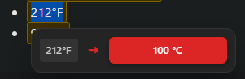

<div align="center">

<h1>Universal Converter - Browser Extension</h1>

<hr>

Instantly convert any unit, currency or timezone by simply selecting them on any page! 



</div>

<br>

A powerful Browser Extension that automatically detects and converts units in selected text, supporting length, weight, temperature, volume, area measurements, and real-time currency conversions with smart auto-sizing and dimension support.

## ✨ Key Features

- **Single-Selection Conversion** - Select individual measurements for precise, instant conversions
- **Real-Time Currency Conversion** - Live exchange rates for 150+ currencies with Arabic/Unicode symbol support
- **Smart Auto-Sizing** - Automatically chooses appropriate units (0.001m → 1mm)  
- **Dimension Support** - Handles formats like "8ft × 4ft × 30in", "6m × 4m × 2.5m"
- **Auto-Save Settings** - With Metric/Imperial presets and manual overrides

## 🚀 Installation
**One Click Installation**
- [Chrome Webstore](https://chromewebstore.google.com/detail/ediegfdjholeejhjdenagnjjjlhafgbl)
- [Firefox Add-Ons](https://addons.mozilla.org/addon/universalconverter/)

**Manual Installation**
1. Click on Code, Download ZIP, Extract files. (or get it from releases for more stable-er build)
2. **Open** `chrome://extensions/`
3. **Enable** "Developer mode" (top right toggle)
4. **Click** "Load unpacked" and select the project folder

## Supported Units

### 🚀 **Acceleration**
- **Units**: meters per second squared (m/s²), feet per second squared (ft/s²), g-force (g)

### 📐 **Area**
- **Metric**: square meter (m²), square centimeter (cm²), square millimeter (mm²), square kilometer (km²)
- **Imperial**: square foot (ft²), square inch (in²), acre

### 💰 **Currency** (150+ currencies with real-time rates)
- USD ($), EUR (€), GBP (£), JPY (¥), CAD, AUD, CHF and more...
- **Unicode Support**: Arabic, Chinese, and other international currency symbols

### 💧 **Flow Rate**
- **Metric**: liters per minute (L/min), cubic meters per second (m³/s), cubic meters per hour (m³/h)
- **Imperial**: gallons per minute (gal/min), cubic feet per minute (CFM), cubic feet per second (CFS)

### 📏 **Length**
- **Metric**: meter (m), centimeter (cm), millimeter (mm), kilometer (km)
- **Imperial**: inch (in), foot (ft), yard (yd), mile (mi)

### 🌍 **Multi-Dimensional**
- **3D Dimensions**: Supports "length × width × height" formats

### 🌬️ **Pressure**
- **Units**: pascal (Pa), bar, pounds per square inch (psi), atmosphere (atm), millimeters of mercury (mmHg), inches of mercury (inHg), torr, kilopascal (kPa), megapascal (MPa)

### 🏃 **Speed**
- **Units**: meters per second (m/s), kilometers per hour (km/h), miles per hour (mph), feet per second (fps), knots (kn), mach

### 🌡️ **Temperature**
- **Units**: Celsius (°C), Fahrenheit (°F), Kelvin (K)

### 🕐 **Time Zones**
- EST, PST, CST, MST, GMT, UTC, CET, JST and more...
- **Format Support**: 12-hour (AM/PM) and 24-hour formats

### 🔧 **Torque**
- **Units**: newton-meter (N⋅m), pound-foot (lb⋅ft), pound-inch (lb⋅in), kilogram-meter (kg⋅m), ounce-inch (oz⋅in)

### 🫗 **Volume**
- **Metric**: liter (l), milliliter (ml)
- **Imperial**: gallon (gal), quart (qt), pint (pt), cup, fluid ounce (fl oz)

### ⚖️ **Weight/Mass**
- **Metric**: kilogram (kg), gram (g), milligram (mg), tonne (t)
- **Imperial**: pound (lb), ounce (oz)

## 🧪 Testing & Development

**Quick Commands:**

```bash
npm test          # Run all automated tests
npm run validate  # Validate extension structure  
npm run build     # Build for distribution
```

## 📁 Project Structure

```
Universal Converter/
├── manifest.json              # Extension configuration
├── background.js              # Service worker (handles API calls & caching)
├── content.js                 # Main content script (text selection & conversion)
├── content.css                # Popup styles
├── package.json               # Node.js dependencies
├── LICENSE                    # MIT License
│
├── data/                      # Conversion data & configuration
│   ├── conversion-data.js     # Unit ratios, patterns, scaling rules, timezone mappings
│   └── currency-mappings.js   # Currency symbols & codes (150+ currencies)
│
├── utils/                     # Core functionality
│   ├── unit-converter.js      # Unit conversion logic & best unit selection
│   ├── currency-converter.js  # Currency detection & conversion
│   ├── conversion-detector.js # Pattern matching & text detection
│   ├── popup-manager.js       # Popup positioning & display
│   ├── settings-manager.js    # User preferences storage
│   └── build.js               # Build script for Chrome/Firefox
│
├── settings-page/             # Extension settings UI
│   ├── settings.html          # Settings interface
│   ├── settings.js            # Settings functionality
│   └── settings.css           # Settings styles
│
├── icons/                     # Extension icons (16, 32, 48, 128px)
│
├── img/                       # Docs images
│
├── tests/                     # Automated test suite
│   ├── test-runner.js         # Core unit tests
│   ├── test-suite.js          # Additional test scenarios
│   ├── popup-interaction-tests.js # Popup UI interaction tests
│   ├── currency-cache-lifecycle.test.js # Currency cache lifecycle tests
│   ├── test-cases.json        # Test case definitions
│   ├── test-cases.schema.json # JSON schema for test cases
│   ├── validate-extension.js  # Extension structure validation
│   ├── run-all-tests.js       # Cross-platform test runner
│   ├── test.html              # Browser test page
│   ├── tests.md               # Test documentation
│   └── test-helpers/          # Test mocking utilities
│       ├── mock-time-controller.js # Time simulation for cache tests
│       ├── mock-storage.js    # In-memory storage mock
│       ├── mock-fetch.js      # API response mocking
│       └── test-utilities.js  # Test fixtures & assertions
│
├── build/                     # Production build for Chrome
│   └── (generated files)
│
├── build-firefox/             # Production build for Firefox
│   └── (generated files)
│
└── .github/                   # GitHub configuration
    └── workflows/             # CI/CD automation
        └── ci.yml             # Continuous integration (auto-testing)
```

## 🔒 Privacy & Security

- **Permissions**: 
  - `activeTab` - Access to current tab for text conversion
  - `storage` - Save user preferences
  - `contextMenus` - Add settings option to extension icon menu
  - `host permissions` - Fetch real-time currency rates from APIs
- **No Data Collection** - Zero tracking or analytics
- **Local Processing** - All conversions happen on your device (only uses API's to fetch Currency Rates)

## 🌐 APIs Used

**Currency Exchange Rates:**
1. **Primary API**: [Exchange Rate Fun API](https://api.exchangerate.fun/) - Real-time currency rates
   - Endpoint: `https://api.exchangerate.fun/latest`
   - 60-minute cache with smart refresh
   
2. **Fallback API**: [Fawaz Ahmed's Currency API](https://github.com/fawazahmed0/exchange-api) - Backup currency data
   - Endpoint: `https://cdn.jsdelivr.net/npm/@fawazahmed0/currency-api@latest/v1/currencies/`
   - Used only when primary API fails

## 🙏 Credits & Acknowledgments

This project integrates currency conversion functionality from [Currency-Converter](https://github.com/adampawelczyk/Currency-Converter) by Adam Pawełczyk. The currency detection, symbol mapping, and real-time exchange rate features are based on this open-source project.

## 📄 License

MIT License - Feel free to use, modify, and distribute.
